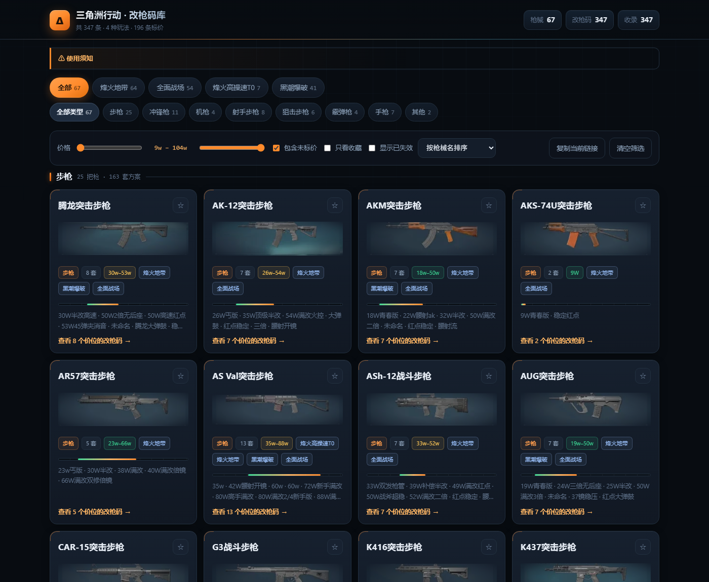
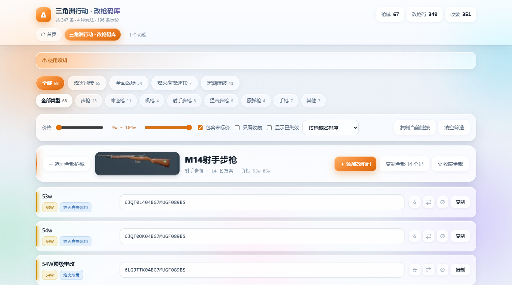
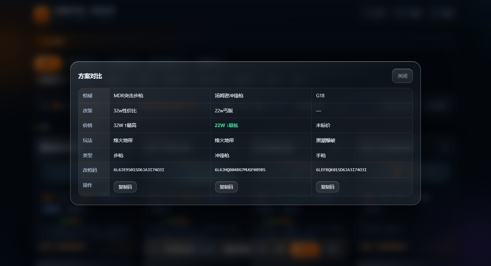
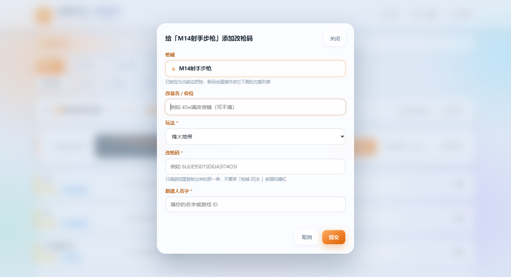
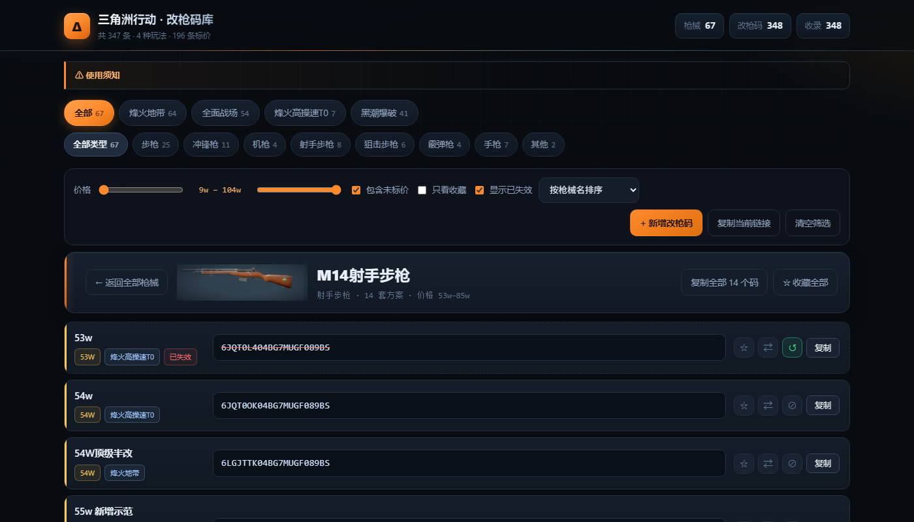

# 哈基米工具箱 · 三角洲行动改枪码库

> **🌐 站点首页：<https://hajimiovo.top/>**
> **🔫 改枪码工具：<https://hajimiovo.top/delta-codes/>**
>
> 手机、电脑直接打开，无需登录，所有人都能新增 / 标记失效改枪码。
> 镜像：<https://hajimi619.github.io/delta-codes/delta-codes/> · 仓库：<https://github.com/hajimi619/delta-codes>
> 接口：<https://api.hajimiovo.top/api/changes>

本站是一个**多功能的个人工具箱**，「三角洲改枪码库」只是其中第一个功能。
骨架已经搭好：**加新功能 = 建一个文件夹 + 在 `docs/assets/site.js` 的数组里加一行**，
首页卡片和每个页面顶部的切换导航都会自动生成。

把一份公开的腾讯文档《三角洲行动改枪码合集》里的改枪码
抓下来，做成一个能搜索、筛选、收藏、对比、一键复制的网页。

**收录 347 个改枪码 / 67 把枪 / 4 种玩法**（烽火地带 202 · 全面战场 86 · 烽火高操速T0 18 · 黑潮爆破 41）


## 功能

**没有搜索框，全部靠分类浏览。** 结构是两级：

1. **首屏按枪械类型分块**（步枪 / 冲锋枪 / 机枪 / 射手步枪 / 狙击步枪 / 霰弹枪 / 手枪 / 其他），每块下面是这类的枪械卡片
2. **点任意一张枪械卡片**，进去看这把枪的每一个价位方案

| 功能 | 说明 |
|---|---|
| 玩法分类 | 顶部标签：全部 / 烽火地带 / 全面战场 / 烽火高操速T0 / 黑潮爆破（数字是**枪械把数**） |
| 类型分类 | 第二排标签：**步枪（突击 + 战斗合并）25** / 冲锋枪 11 / 机枪 4 / 射手步枪 8 / **狙击步枪 6** / 霰弹枪 4 / 手枪 7 / 其他 2；不选时按类型**分块显示**，选了就只看这一类 |
| 枪械卡片 | 一张卡一把枪：**枪械图** + 类型 / 套数 / 价格区间 / 玩法 / 方案名预览，右上角 ★ 整把收藏 |
| 方案详情 | 点卡片进入，按价格从低到高列出每个价位：改装名 + 价格 + 玩法 + 改枪码 + 复制/收藏/对比 |
| 价格筛选 | 双滑块按价格过滤（价格从"32w性价比"这类改装名里解析），可勾选是否包含未标价 |
| 排序 | 按枪械名 / 最低价从低到高 / 最高价从高到低 / 方案数量 |
| 收藏 | 枪械卡片上 ★ 整把收藏，详情里每套可单独收藏；存在浏览器本地，顶部会出现「★ 收藏」页签 |
| 对比 | 详情页每套 ⇄，最多同时选 3 套，底部对比栏 → 并排表格（自动标出价格最高/最低） |
| 复制全部 | 详情页「复制全部 N 个码」，多行文本一行一个码，整批粘进游戏；**数量跟随当前筛选** |
| 分享链接 | 「复制当前链接」把玩法、类型、价格、排序、**正在看的那把枪**都编进 URL，打开就是同一视图 |
| 返回/前进 | 进入和退出枪械详情走浏览器历史，手机返回手势和浏览器后退键都能用 |






## 本地打开

直接双击 `docs/index.html`，纯静态、不需要服务器、不联网。

## 目录

```
delta-codes/
├─ docs/                     ← 发布目录（Cloudflare Pages + GitHub Pages 共用）
│  ├─ index.html             站点首页：功能导航（卡片由 site.js 生成）
│  ├─ assets/
│  │  ├─ theme.css           共用主题：浅色液态玻璃 + 顶栏 + 按钮 + 弹窗 + 表单
│  │  └─ site.js             功能注册表 FEATURES + 导航/首页卡片渲染
│  ├─ delta-codes/           ← 功能①：三角洲改枪码库
│  │  ├─ index.html          工具页（只写自己专属的样式）
│  │  ├─ data.js             由 build_site.py 生成（window.DELTA_DATA）
│  │  └─ img/guns/*.webp     68 张枪械图
│  └─ .nojekyll
│  └─ (以后的新功能)/         每个功能一个文件夹，互相独立
├─ data/
│  ├─ codes.json             抓取结果（基础数据，含来源 tab / 行列号）
│  └─ gun-images.json        枪名 → 图片文件名 的映射
├─ assets/
│  └─ gun-screenshots/       游戏图鉴截图（枪械图的来源，13 张）
├─ worker/                   ← 在线编辑后端（Cloudflare Worker + D1）
│  ├─ worker.js              接口代码
│  ├─ schema.sql             数据库结构
│  └─ README.md              部署指南（点点点 + 粘贴，约 5 分钟）
├─ config.json               配置：apiBase 填 Worker 地址；留空 = 只读模式
├─ scripts/
│  ├─ fetch_codes.py         从腾讯文档抓取并解析 → data/codes.json
│  ├─ extract_gun_images.py  从图鉴截图裁出每把枪 → docs/delta-codes/img/guns/*.webp
│  ├─ build_site.py          data/*.json → docs/delta-codes/data.js
│  ├─ build_singlefile.py    打包成单文件 dist/delta-codes.html（图片内联）
│  ├─ deploy_github.py       纯 REST API 部署到 GitHub Pages（不需要 git）
│  └─ deploy_pages.ps1       部署 docs/ 到 Cloudflare Pages（走 wrangler）
├─ preview/                  截图
└─ .github/workflows/
   └─ refresh-codes.yml      在 GitHub 上手动触发一次数据刷新（可选定时）
```

## 怎么加一个新功能

1. 建目录 `docs/<功能id>/`，放一个 `index.html`
2. 头部引共用主题（注意层级）：
   ```html
   <html lang="zh-CN" data-base="../">     <!-- 让 site.js 能拼对链接 -->
   <head>
     <link rel="stylesheet" href="../assets/theme.css" />
   </head>
   <body>
     <header class="top">
       <div class="top-in"> …品牌 + 统计… </div>
       <nav class="fnav" id="siteNav"></nav>   <!-- 自动生成功能切换 -->
     </header>
     …
     <script src="../assets/site.js"></script>
   </body>
   ```
3. 在 `docs/assets/site.js` 的 `FEATURES` 数组里加一条：
   ```js
   { id:"<功能id>", name:"功能名", desc:"一句话说明",
     tags:["标签"], status:"online", icon:"★" }
   ```
4. 部署。首页卡片和所有页面的顶部导航会自动出现。

共用样式已经包括：设计变量、七彩背景、顶栏、`.btn`、`.badge`、`.card`、
`.modal`、`.toast`、`.totop`、`.form-grid`、`.empty`、`.hero`、`.fcard`。

## 枪械图是怎么来的

原始素材是 13 张游戏内**枪械图鉴列表**截图（放在 `assets/gun-screenshots/`）。
`scripts/extract_gun_images.py` 会自动把每把枪裁成独立小图：

1. 图鉴每行固定高约 **89px**，行内**左上角是白色枪名文字**、下方才是枪身
2. 先用「左上角近白文字」定位每一行，行距用等差数列拟合（比按高度均分稳）
3. 再取标题下方的窗口，用**边缘强度**找枪的轮廓外接框——
   背景是平滑渐变几乎没有边缘，枪有清晰轮廓，所以这个判据比"和背景色做差"可靠得多
4. 图鉴里被**选中**的那一项有一圈近白色高亮边框，会按
   「贯穿整行/整列 + 亮度 > 200」识别出来，连同两侧的抗锯齿一起剔除

输出 68 张 WebP（每把枪约 1.5 KB，**合计 105 KB**），页面用 CSS 径向遮罩把图片边缘
淡出，融进卡片背景。

重新生成：

```powershell
& $py scripts\extract_gun_images.py
& $py scripts\build_site.py
```

## 在线编辑

站点**已经开启**在线编辑，后端是 **Cloudflare Worker + D1**（免费额度足够），
接口地址 <https://api.hajimiovo.top>，写进 `config.json`：

```json
{ "apiBase": "https://api.hajimiovo.top" }
```

`apiBase` 留空即回到只读模式。部署步骤见 [worker/README.md](worker/README.md)。

页面上的入口：**先点开某把枪**，在它详情页右上角点 **「＋ 添加改枪码」**——
枪名会锁定成当前这把枪，提交后直接并进它下面的方案列表，不会另起一张卡片。
每条的失效开关在右侧的 **⊘**（已失效的点 **↺** 恢复）。

**接口：**

| 方法 | 路径 | 作用 |
|---|---|---|
| GET | `/api/changes` | 拉取全部改动（新增 + 失效标记） |
| POST | `/api/add` | 新增一个改枪码 |
| POST | `/api/flag` | 标记失效 / 恢复 |

**防滥用：** 同一个码不能重复提交 · 每 IP 每小时最多 30 次写操作 ·
枪械名 / 名字 / 备注都有长度上限 · CORS 只放行自有域名和 GitHub Pages。

**设计上刻意做了两层保护：**

1. **删除 = 标记失效**，不是真删。码还在，只是折叠 + 显示"已失效"，任何人可点 ↺ 恢复。
2. **基础 347 条不在数据库里**，而是躺在仓库的 `data/codes.json`（有 git 历史）。
   数据库只存"新增"和"失效标记"，所以**就算数据库被清空，基础数据一条不少**，
   重跑一次 `fetch_codes.py` 就恢复。

新增时会要求填 **新建人名字**，列表上会显示"由 XXX 添加"。




## 访问速度 / 国内可用性

站点跑在 **Cloudflare**（Pages + Worker），国内访问**能连上但不稳**。实测：

| 环节 | 实测 | 说明 |
|---|---|---|
| DNS 解析 | 5–20ms | 正常 |
| TCP 连接 | 200–250ms | **偏大**（就近节点应 30–60ms） |
| TLS 握手 | 0.5s ~ 21s，偶发超时 | **瓶颈在这** |
| `CF-RAY` 落地机房 | **LAX（洛杉矶）** | 中国流量被路由到美国西岸 |

根因是**线路**，不是网站：Cloudflare 免费版在中国大陆没有就近节点，
运营商 BGP 把流量丢到了洛杉矶，200ms+ 延迟叠加丢包，TLS 握手反复重传。

> **换数据库没有任何帮助。** 实测静态页面和接口的耗时几乎一样
> （tcp 0.2–0.3s / tls 0.5–3.7s / ttfb 0.9s~超时），瓶颈都在同一段网络上。
> 数据库只决定那 1.6KB JSON 的内容，请求照样得走这条路。

已经做的免费优化：

| 措施 | 效果 |
|---|---|
| `sw.js` Service Worker | **第二次起完全走本地缓存**，不依赖网络 |
| 接口改同源 `/api/*`（Worker 路由） | 省掉一次跨域 TCP + TLS 握手 |
| 开 0-RTT / Early Hints | 复访握手省一个来回 |
| HTML 里 preconnect 接口域名 | 提前建连 |
| `_headers` 缓存策略 + favicon | 图片长缓存，每次少一个 404 |
| 顶栏「接口 已连接 / 连不上」徽章 | 区分"后端连不上"和"没人提交过" |
| 接口失败自动重试一次 | 提高成功率 |

### 试过但没用的两条路（别再踩）

**① 换 Cloudflare 的 IP 段 —— 无效**

实测 44 个 Cloudflare IP 段，确实有好段（`104.26.x` / `162.159.128.x` 落**香港**，首字节 286ms，
而当前分到的 `104.21.x` / `172.67.x` 实测**直接超时**）。

于是把 zone 删掉重建，想赌一个新 IP：

```
删除前：104.21.61.140, 172.67.210.249
重建后：104.21.61.140, 172.67.210.249   ← 一模一样，连 zone_id 都复用了
```

**结论：Cloudflare 给一个域名的边缘 IP 是固定的，删了重建也白搭。**
（免费版没有官方途径更换；网上流传的「优选IP」需要 Cloudflare for SaaS，会破坏
Pages 的自定义域名，不值得折腾。）

**② 关掉代理直连 pages.dev —— 更慢**

既然 pending 状态下 CNAME 会直接透传到 `pages.dev` 的 IP，就测了一下：

| | 成功 | 中位首字节 | 最慢 |
|---|---|---|---|
| 走 Cloudflare 代理（现状） | 7/8 | **1.4 秒** | 11.9s |
| 直连 pages.dev 的 IP | 8/8 | **3.6 秒** | 24.0s |

**直连反而更慢**，而且会破坏 `hajimiovo.top/api/*` 的 Worker 路由。

**要根治只能把站点搬离 Cloudflare**：

| 方案 | 国内速度 | 成本 | 门槛 |
|---|---|---|---|
| **国内轻量服务器** ⭐ | 最快（RTT 10–30ms） | **¥192/年**（常见 4 折） | 要 ICP 备案，1–3 周 |
| 香港轻量服务器 | 30–60ms，**晚高峰不稳** | ¥456/年 | 不用备案，但腾讯云官方写明「不保障跨境质量」 |
| CN2 GIA 优化线路 VPS | 30–60ms 稳定 | ¥350–700/年 | 免备案，但要会挑商家 |

> **避坑**：腾讯云/阿里云的香港、新加坡低配轻量（¥34–40/月）线路都是普通国际 BGP，
> 官方明确标注**不保障中国内地与香港之间的跨境质量**，晚高峰可能比 Cloudflare 还差。
> 真要免备案又稳定，得上 CN2 GIA，那就 ¥350–700/年了 —— 不如备案划算。

### 迁移到国内服务器（进行中）

已经买了一台腾讯云轻量（南京，2核2G，¥192/年），并配好了整套环境：

```
119.45.171.242   （备案通过前先用 http://119.45.171.242:8080/ 访问）
├─ /var/www/hajimiovo/          站点静态文件（由 deploy_server.py 上传）
├─ /opt/hajimiovo-api/server.js 接口服务（Node，无任何 npm 依赖）
├─ /var/lib/hajimiovo/changes.json  网友改动（JSON + 原子写入，替代 D1）
├─ systemd: hajimiovo-api       守护进程，崩溃自动重启
├─ nginx                        静态托管 + 反代 /api/*，gzip，缓存策略
└─ /root/s3_golive.sh           备案通过后一键开 80/443 + 申请 HTTPS 证书
```

**实测速度对比**（同一时刻，两台机器）：

| | **南京服务器** | Cloudflare（洛杉矶） |
|---|---|---|
| TCP 连接 | **17–36ms** | 296–558ms |
| 首字节 | **33–86ms** | 4.1–14.7 秒 |
| 总耗时 | **0.04–0.09 秒** | 15.6–25 秒 |

**为什么后端不用 SQLite**：接口只需要存网友的几十条改动，用 JSON 文件 + 原子写入
（先写 `.tmp` 再 `rename`，写入串行化）完全够用，**零 npm 依赖**，部署不会因为
原生模块编译失败而卡住，备份就是复制一个文件。

**部署命令**：

```powershell
# 站点
& $py scripts\deploy_server.py
# 站点 + 后端（改了 server.js 时）
& $py scripts\deploy_server.py --api --reload-nginx
```

**备案通过后的切换步骤**：

1. 腾讯云防火墙放行 TCP **80、443**（8080 可以关掉了）
2. DNS 把 `hajimiovo.top` 指到 `119.45.171.242`
   - 快：Cloudflare 里把 A 记录改成这个 IP，**代理关掉（灰云）**，几分钟生效
   - 彻底：NS 改回腾讯云 DNSPod，1–2 小时生效
3. SSH 上去跑 `/root/s3_golive.sh` —— 自动配 80/443 + 申请 Let's Encrypt 证书 + 设置自动续期
4. 验证 `https://hajimiovo.top/`

> 切换完成后 Cloudflare 的 Pages / Workers / D1 就都可以停用了。
> 注意 `docs/sw.js` 里的 `VERSION` 要 bump 一次，否则老访客的 Service Worker
> 会继续用云端缓存的旧文件。

## 更新数据

本地（推荐）：

```powershell
$py = "C:\Users\哈基米.OBITO\.dsh\dsh-runtimes\dsh-primary-runtime\dependencies\python\python.exe"
cd D:\APP\dswork\delta-codes
& $py scripts\fetch_codes.py --out data\codes.json
& $py scripts\build_site.py
```

刷新浏览器即可。仓库里还带了 `.github/workflows/refresh-codes.yml`：
推到 GitHub 后，在 Actions 里点「Run workflow」也能刷新（会自己 commit 回仓库，
Pages 随后自动重新发布）；想每天自动跑就把 `schedule` 的注释打开。

## 部署

站点同时发布到两个地方，内容一样：

| 目标 | 地址 | 部署方式 | 说明 |
|---|---|---|---|
| **Cloudflare Pages** | <https://hajimiovo.top/> | `scripts/deploy_pages.ps1` | **主站**。国内可直连（约 1–3 秒） |
| GitHub Pages | <https://hajimi619.github.io/delta-codes/> | `scripts/deploy_github.py` | 镜像 / 备份 |

```powershell
cd D:\APP\dswork\delta-codes
& pwsh scripts\deploy_pages.ps1      # Cloudflare（token 放在 ..\.cf-token）
& $py scripts\deploy_github.py --token-file ..\.gh-token --repo delta-codes
```

两个脚本都会跳过内容没变的文件。

### 域名与解析

- `hajimiovo.top` / `www.hajimiovo.top` → CNAME → `delta-codes.pages.dev`（Cloudflare 代理）
- `api.hajimiovo.top` → Cloudflare Worker `delta-codes-api`（自定义域名）
- DNS 托管在 Cloudflare（NS：`mckenzie` / `robert`.ns.cloudflare.com），**不需要备案**

> 为什么不用 Worker 自带的 `*.workers.dev`：那个域名在国内被 DNS 污染，
> 普通用户**完全连不上**，接口会一直失败。换成自己的域名后国内实测可以直连。

## 发布到 GitHub Pages

1. 在 GitHub 建一个空仓库（public）。
2. 在本目录执行：

   ```bash
   git init
   git add .
   git commit -m "三角洲改枪码库"
   git branch -M main
   git remote add origin https://github.com/<你的用户名>/<仓库名>.git
   git push -u origin main
   ```

3. 仓库 **Settings → Pages**：
   - Source 选 **Deploy from a branch**
   - Branch 选 **main**，目录选 **/docs**
   - Save
4. 等 1 分钟左右，访问 `https://<你的用户名>.github.io/<仓库名>/`。

> 因为发布目录就叫 `docs`，不需要任何构建步骤，Pages 直接读这个文件夹。

## 数据是怎么拿到的

腾讯文档没有开放 API。它的表格数据以 **zlib 压缩的 protobuf** 内嵌在页面接口里：

1. `GET https://docs.qq.com/dop-api/opendoc?tab=<tabId>&id=<docId>&outformat=1...`
2. 返回 JSON 的 `clientVars.collab_client_vars.initialAttributedText.text[0]`
   里，`block_datas[*].related_sheet` 是 base64 的 zlib 数据块
3. base64 解码 → `zlib.decompress` → protobuf
4. 关键结构 `sheet.r0.f19[0]`：
   - `f3` = 表信息（表 id、行数、列数）
   - `f5` = 单元格文本表（共享字符串）
   - `f6` = 单元格：`{f1: 行, f2: 列, f3: {f2: {f1: 文本索引}, f4: {f1: 样式索引}}}`
5. **只有含文本的单元格**，其 `f3` 会多出 `f1`/`f2` 两个字段，`f3.f2.f1` 就是文本索引。

`scripts/fetch_codes.py` 自带一个通用 protobuf wire-format 解析器（不需要 `.proto` 文件），
所以腾讯调整字段顺序也不会立刻失效。

## 几个实现上的取舍

- **枪械名从改枪码本身解析**（`MDR突击步枪-烽火地带-6L6J...` → `MDR突击步枪`），
  因为原表的枪械名是跨行合并单元格，逐行读会错位。
- **记录 id 用 `玩法|改枪码`**：有 5 个码同时出现在烽火和 T0 两个表里，光用码会撞。
- 大战场那个 tab 同一份码在 3 组列里重复了 3 遍（原表注明"哪列方便用哪列都是一样的"），已按码去重。
- 原表有 151 条没写价格，所以价格筛选默认勾选「包含未标价」，避免一拉滑块东西全没了。
- 原表里有些格子把枪械名当改装名（"沙鹰"），生成数据时已剔除。

## 已知限制

- 数据是**快照**：腾讯文档更新后需要重新跑一次脚本（或点一次 Action）。
- 抓取用了固定分片参数（`endrow=60&block_end_row=255`）。如果某个 tab 突然抓不到数据，
  多半是腾讯改了分片参数，调 `scripts/fetch_codes.py` 里 `fetch_tab()` 的 query 即可。
- 改枪码随游戏版本变动，遇到失效换一套或稍后再试即可。
